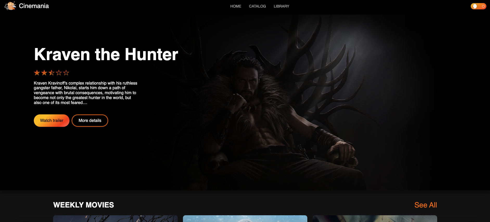
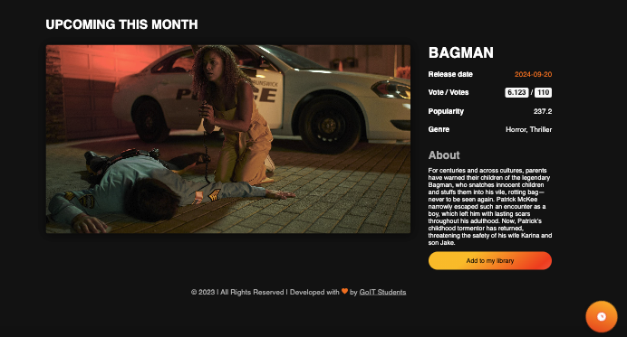
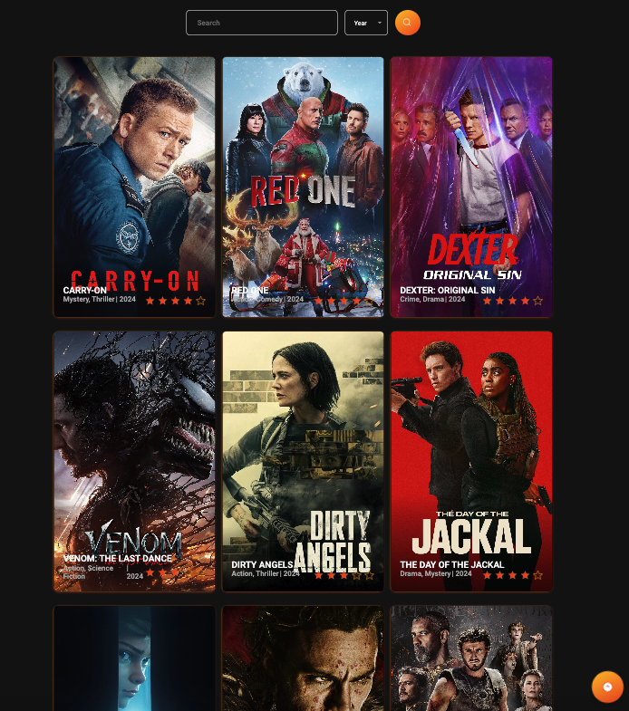

# WebSite Cinemania

### Development team :

- Gökhan Karaduman **Team Lead** development and design of the section **Catalog, Footer, Scroll Up, Pagination, Custom Cursors, Favicon, API, Loader**

- Ferhat İpek **Scrum Master** development and design of the section
  **API, Fetch, Home Page, UPCOMING THIS MONTH**

- Sudenur Çelik **Front End Developer** development and design of the section
  **Home Page, UPCOMING THIS MONTH, API, Fetch**

- Furkan Uçar **Front End Developer** development and design of the section
  **Modal Window Team, Responsive Design, Catalog**

- Samet Tufan Çalım **Front End Developer** development and design of the
  section **Hero, Catalog**

- Salih Enes Alıcı **Front End Developer** development and design of the section
  **Library, Theme Switcher**

- Segah Vahide **Front End Developer** development and design of the
  section **Library, Theme Switcher**

## In this project, the following technologies were utilized:

- **Frontend:** HTML5, CSS3, JavaScript (ES6+)
- **Backend:** Node.js
- **API:** https://www.themoviedb.org/
- **Version Control:** Git, GitHub
- **Bundler:** Vite
- **Design Tools:** Figma

- `Look at`
  [**Layout (Figma)**](https://www.figma.com/file/z7VY1GvA5xVR2ix7xeOfxx/Cinemania?node-id=0%3A1&t=5JeXJy1vNB96LXPG-1)

1. Install the project dependencies in the terminal with the command
   `npm install` .
2. Start development mode by running the command `npm run dev`.
